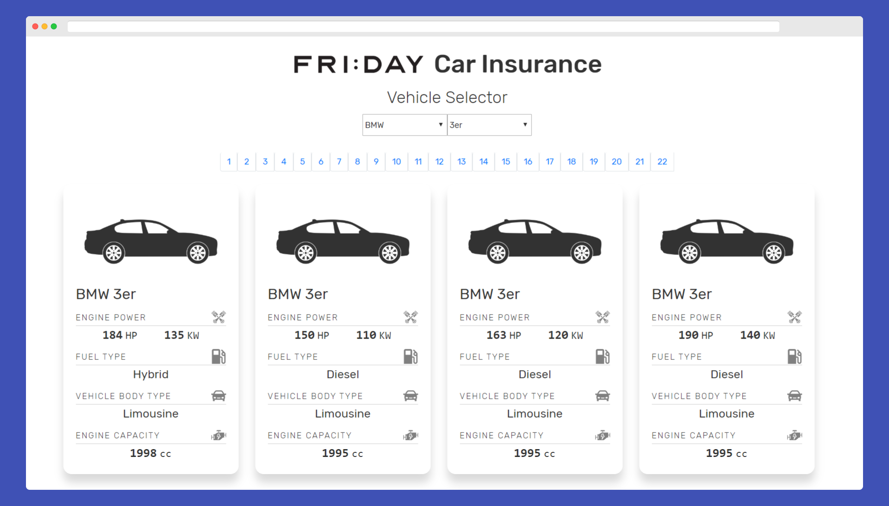

<h1 align="center">FRIDAY Code Challenge</h1>



## Table of Contents

- [Getting Started](#getting-started)
- [Built With](#built-with)
- [Improvements](#improvements)
- [Author](#author)

## Getting Started

To clone and run this application, you'll need [Git](https://git-scm.com) and [Node.js](https://nodejs.org/en/download/) (which comes with [npm](http://npmjs.com)) installed on your computer. From your command line:

1. Clone this repository

```sh
git clone https://github.com/guidosantillan01/friday-code-challenge
```

2. Go into the repository

```sh
cd friday-code-challenge/app
```

3. Install dependencies

```sh
npm install
```

4. Run the app, you will then be able to access it at `localhost:3000`

```sh
npm start
```

> Note: If you're using Linux Bash for Windows, [see this guide](https://www.howtogeek.com/261575/how-to-run-graphical-linux-desktop-applications-from-windows-10s-bash-shell/) or use `node` from the command prompt.

**To run only the server**

```sh
npm run server
```

**To run only the app front-end**

```sh
cd friday-code-challenge/app
npm install
npm run app
```

## Built With

- [create-react-app](https://create-react-app.dev/) - Create React apps with no build configuration.
- [node-sass](https://www.npmjs.com/package/node-sass) - It allows you to natively compile .scss files to css at incredible speed and automatically via a connect middleware.
- [concurrently](https://www.npmjs.com/package/concurrently) - Used to run multiple commands concurrently. In this case, to run the server and the app using one command.
- [@testing-library/react](https://testing-library.com/docs/react-testing-library/intro) - Builds on top of DOM Testing Library by adding APIs for working with React components.
- [@testing-library/jest-dom](https://www.npmjs.com/package/@testing-library/jest-dom) - Provides a set of custom jest matchers that you can use to extend jest.
- [fetch API](https://developer.mozilla.org/en-US/docs/Web/API/Fetch_API)
- [Postman]

## Improvements

1. Implement **caching** to store already fetched data.
1. Implement **Redux** to manage the application state in a better way.
1. Improve **pagination** feature.
1. Implement **search box** feature.
1. Implement **order by** feature
1. Add **more test** cases.
1. Load **pictures** for each vehicle model.
1. Implement the **7–1 Sass/SCSS Pattern**.

## Author

[Guido Santillan](https://www.guidosantillan.com)
